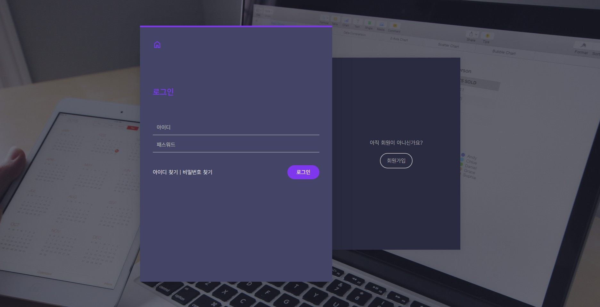
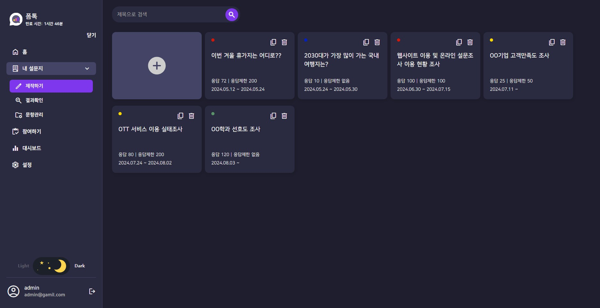
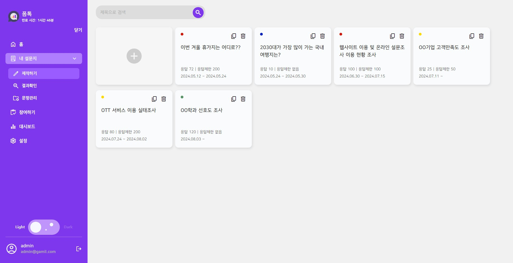

# 설문조사 대시보드

### [[조사하러 가기](https://formtok.vercel.app/)]

<br>

## 미리보기
### 1. 메인 히어로
   - 로그인 버튼을 통해 로그인 페이지로 이동합니다.
   - 시작하기를 통해 대시보드 페이지로 이동합니다.


<br><br>
   
### 2. 로그인 페이지
   - 로그인 후 대시보드 페이지로 이동합니다.
   - 회원가입 페이지와 같이 사용하고 있습니다.


<br><br>
   
### 3. 대시보드 페이지
   - 모든 작업을 하는 페이지 입니다.
   - 로그인 후 이용가능한 기능들이 많습니다.



<br><br>

## 제작 사유
- 나에게 2번째 필요한 페이지 대시보드 <br>
- 추후에 상품 관리 및 관리자 페이지를 만들기 위해 연습

<br>

## 사용한 라이브러리 및 이슈
### 1. jwt-decode
   - 토큰 디코딩 라이브러리
   - 로그인 후 token을 가져와서 exp타임을 추출해서 로그인 만료시간 구현을 위해 사용했다.

### 2. react-beautiful-dnd
   - 드래그앤 드롭 라이브러리 (~~react-dnd 사용후 취소~~)

   - 처음엔 커스텀으로 구현했었다. [[참고한 영상]](https://www.youtube.com/watch?v=CJycVlSuaPg)
   - 커스텀으로 구현한 드래그앤 드롭은 드래그 중 dragEnter가 되면서 너무 좁은 부분에 사용하는경우, <br>
     enter와 leave의 경계선에서 커졌다 작아졌다를 반복했다.
   - ~~debounce를 사용해 구현해보려 했으나 실패.. 다음에 재도전 하겠다!~~

   - 영어라 너무 어려웠다.. 1차 배열로 만들어서 여러개 돌려보면서 사용법을 찾아냈다..
   - 페이지를 드래그했을 경우는 전체 드래그 되도록, <br>
     문항을 드래그했을 경우는 문항만 드래그 되도록 구현했다. 한 3일 걸린듯 하다.(2차배열 구현 완료)
   - DragDropContext : 드래그 전체 범위 / Droppable : 떨구는 범위 / Draggable : 드래그 아이템

### 3. ~~react-contenteditable~~
   - 텍스트를 입력할 수 있는 라이브러리 = 인풋창 + 엔터 가능?
   - 설명 부분은 텍스트를 수정할수 있는 기능을 구현하고 싶었다.
   - 사용법은 생각보다 간단했다.
  
### 4. CKEditor
   - 3번의 라이브러리는 텍스트 수정을 하는 에디터가 없어서 사용을 포기했다.
   - 텍스트를 수정할수 있는 툴들이 나온다.
   - 설명 부분을 클릭하면 나오도록 구현했다.
   - css로 묶여있는게 많아서, 디자인을 커스텀하기 어려웠다.
   - 한땀한땀 찾아보며 css 변경 완료 <br>
     
   - 처음 기본으로 나오는 툴에는 취소선과 밑줄등 기본적으로 제공되는 툴이 몇개 없었다.
   - 사용하기 위해 공식 사이트에 들어가니, 커스텀해서 사용을 해야한다고 적혀있었다.
     사이트의 방법을 따라 커스텀한 툴을 사용했다.

### 5. styledComponent
   - css + wrapper역할 라이브러리
   - 처음 시작할땐 index.css를 만들어서 구현을 했었다.
   - 너무 많은 css파일이 생기니 찾아가기가 어려웠다.
   - 컴포넌트를 눌러가며 찾을수 있어서 편해졌다.
   - globalstyle을 만들어서 사용하려 했으나, css처럼 컬러가 표현되지 않아서
     글로벌스타일은 app.css로 구현했다.

### 6. axios
   - RESTAPI에서 데이터를 사용하기위한 라이브러리
   - 서버 데이터를 보낸다, 가져온다.

### 7. classnames
   - 클래스네임을 객체형식으로 넣는 라이브러리

### 8. react-router-dom
   - path를 따라 여러곳으로 이동하기 편해지는 라이브러리
   - Routes와 Route의 만남

### 9. recoil
   - 상태관리 라이브러리
   - 데이터를 불러오거나 자주 사용하는 상태들을 전역으로 빼서 사용을 하고있다.
   - 설문조사를 만들때 폼 전체가 그 예시 이다.

<br>

## 브레이크
### 1. 버셀 배포 오류
   - 초기 gh-pages로 깃허브 배포로 사용했으나, 렌더링이 너무 느려서 vercel로 전환했다.
   - 위와 같은 오류가 발생했다.
   - 깃허브에 푸시를 해도 파일명의 대소문자를 구분하지 않는다.
   - 해결 방법으로 아래와 같이 행동했다.
   
   ##### 대소문자 구분
   ```
   git config core.ignorecase false
   ```

   ##### 캐시 삭제
   - 캐시 삭제 이유 : 위의 코드 실행 후 바로 푸시하는 경우 파일이 2개가 생겨버린다. 주의할 것
   ```
   git rm -r --cached .
   ```

   ##### 배포
   ```
   git add .
   git commit -m "Rename: Modify Case"
   git push
   ```

### 2. 번역시 구글 아이콘이 폰트로 나오는 문제
   - 여러 지인에게 홈페이지 테스트 중에 페이지 자동번역을 쓰는 지인이 있었다. <br>
     그 사람의 컴퓨터에만 페이지가 이상하게 나온다고 해서 번역을 눌러보니, <br>
     구글아이콘이 폰트로 나오는 문제가 있었다.

   ##### 해결법
   - classname에 notranslate를 추가한다.
   - 컴포넌트로 만들어서 사용중이라 참 다행이었다.
     
   ```
   function Icon ({ code, handleclick, className }) {
       return <span 
       className={`material-symbols-outlined notranslate icon ${className}`}
       onClick={handleclick}
       >{code}</span>
   }
   ```

   ##### 전체 번역을 해제할 경우
   - index.html header에 추가하기
     
   ```
   <meta name="google" content="notranslate" />
   ```
   
### 3. 설문지를 불러올때 답변창을 불러오지 못하는 문제
   - 현제 설문지의 데이터 구조는 <br>
     여러 페이지의 묶음안에 질문들의 묶음으로 구성된 이줄 배열로 구현 되어있다. <br>
     (자세한 데이터 구조는 일려드릴 수 없습니다.)
   - 여기서 페이지의 id와 질문의 id를 가져와서 답변을 담을수 있는 객체를 만들어서 사용하고 있었다.
   - 불러오는 중에 랜더링되기 전엔 페이지의 id와 질문의 id가 없기때문에 오류가 발생했다.
   - 파일이 없다면 아무것도 불러오지 않도록 컴포넌트를 수정해서 해결했다.
     
   ```
   fuction ViewerQuestionForm () {
      /** ... 생략 */
      if (!answerBox[pageId]) { // 불러오기 전 화면
           return <></>
       }

      return (
         /** 데이터 생성 후 불러올 화면 */
      )
   }
   ```

### 4. 리스트 스타일에 따라 가공해서 사용해야 하는 경우
   - 설문 문항의 리스트 스타일에 따라서 두가지의 switch case문이 여러곳에서 필요했다.
   - 함수를 따로 만들어서 사용할까 했지만, 정말 운 좋게도 recoil의 selector라는 것을 알게 되었다.
   - 아래와 같이 사용하여 리스트 스타일이 변경될때마다 selector들이 변경되도록 하여 사용하였다.
   - 사용방법은 useRecoilValue로 selector를 가져오면 된다.

   ```
   const surveyListStyleAtom = atom({
       key: 'survey-list-style',
       default: null
   })
   
   const surveyListStyleTextSelector = selector({
       key: 'surveyListStyleTextSelector',
       get: ({ get }) => {
           const style = get(surveyListStyleAtom)
           switch (style) {
               case 'N':
                   return '1. 2. 3.'
               case 'Q':
                   return 'Q. Q. Q.' 
               case 'QN':
                   return 'Q1. Q2. Q3.' 
               case null:
               default:
                   return '없음' 
           }
       }
   })
   
   const surveyListStyleSelector = selector({
       key: 'surveyListStyleSelector',
       get: ({ get }) => {
         const surveyListStyle = get(surveyListStyleAtom)
         return (qi) => {
           switch (surveyListStyle) {
               case 'N': 
                   return (qi + 1) + '.'
               case 'Q': 
                   return 'Q.'
               case 'QN': 
                   return 'Q' + (qi + 1) + '.'
               case null: 
           default: 
               return ''
           }
         }
       },
   })
   ```

### 5. 로그인 페이지로 바로접속시 페이지를 벗어나는 문제
   - 처음엔 navigate(-1)을 사용하고있었다.
   - 만약에 로그인페이지로 갑자기 들어오는 경우의 수가 떠올랐다.
   - 이문제를 해결하기위해 useNavigate와 useLocation을 사용하여 구현하였다.

   #### 로그인 페이지로 이동하는 곳에서의 함수
   ```
   ()=>navigate('/user/login', {state : { from: location.pathname }})
   ```

   #### 로그인 후 이동하는 페이지의 함수
   ```
   const loginAction = async (e) => { // 로그인
        e.preventDefault()
        const {userId, password} = loginInputs
        const result = await login(userId, password)
        if (result) {
            location.state?.from ? navigate(location.state?.from) : navigate('/')
        }
    }
   ```

<br>

## 서버는?
### 1. express.js로 제작했다. ( **""** 는 라이브러리다)
   - **"express-vaildator"** 를 이용하여 회원가입 시 유효성 검사를 진행했다.
   - **"express-axync-handler"** 라우팅 핸들러에서 async await을 사용 가능하게 해준다. <br>
     사실 문제가 없는 async/await 이라면 상관없지만, 에러가 발생할경우를 잡아주지 못한다. <br>
     이 라이브러리는 에러처리를 쉽게 해주기 때문에 사용한다. <br>
   
   - **"dotenv"** 를 사용하여 env의 은밀한 정보를 가져와서 사용했다.
   - 이후에 vercel에 추가하여 사용하기에 local로 사용할때만 이용한다. <br>
   
   - **"cors"** 를 이용해서 cors오류가 발생하지 않도록 했다. <br>
   
   - **"jsonwebtoken"** 로그인 후 정보전달의 꽃 토큰 라이브러리다.
   - 개인정보를 여러번 사용 할 필요없이 토큰을 지금하여 개인을 확인한다. <br>
   
   - **"mongoose"** mongoDB와 연결하여 사용하는 라이브러리다.
   - 스키마를 생성하여 데이터를 넣을수 있는 구조를 커스텀하여 만들 수 있다.
   - 생성한 스키마를 이용하여 데이터 생성, 수정, 삭제, 전달이 가능해졌다.

### 2. vercel
   - 버셀을 사용하기 위해서는 기초 설정이 필요하다 아래와 같이 사용했다.
   - vercel.json 파일을 만들어서 최상단에 저장한다.
   - index.js를 api폴더를 생성후 안에 넣는다.
   - 경로 기준을 바꾼다.
   - 버전과 지역정보 cors등을 설정한다.
   
   - 하지만 이게 끝이 아니다. vercel에 접속 후 세팅을 해줘야한다.
   - vercel의 환경변수에 mogoDBURI, jwt-secretkey등을 저장한다.
   - **☆중요☆ function 부분에 들어가서 region을 icn1로 변경한다.** <br>
     이게 없으면 gateway-timeout 500에러가 걸리는데 그냥 작업이 느린줄 알았으나, 지역적인 문제였다. <br>
     진짜 있지말고 꼭 기억하도록 해야한다.

   - vercel을 사용하는 이유는 github와도 연결이 편하고, commit한 순간 알아서 서버가 갱신된다.
  
### 4. mongoDB
   - 데이터 저장을 위해 사용한다.
   - noSQL 시스템이다. 관계형을 생각하지 않고 데이터 구조를 편하게 구현할 수 있다.

<br>
   
## 이후 진행 필요사항
1. 메인페이지 디자인 수정하기
2. ~~설문지 미리보기~~(구현 완료)
3. 설문 문항 타입(표 타입 제외 구현 완료)
4. 설문한 데이터 받기
5. 통계내기
6. 로그인 유저, 비로그인 유저 권한 설정
7. 프로필 페이지 제작하기
